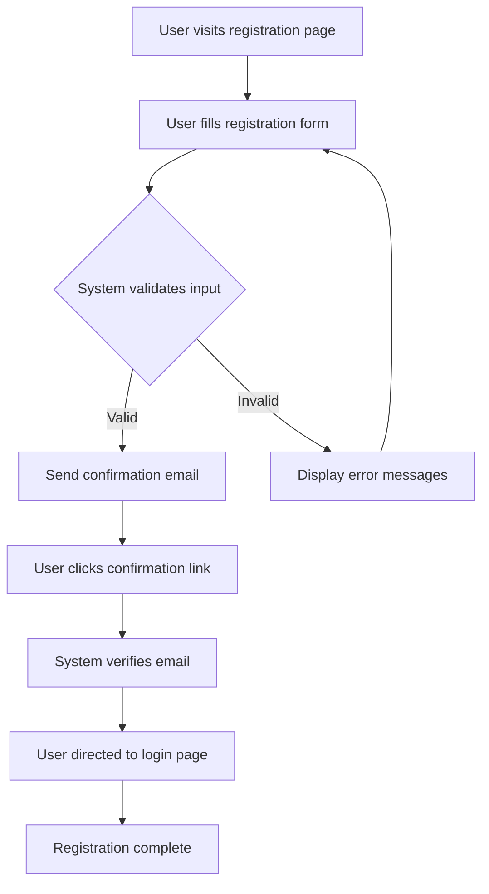
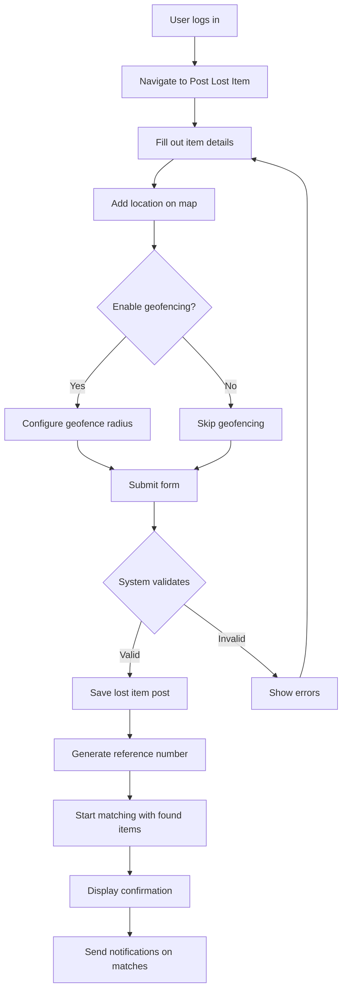
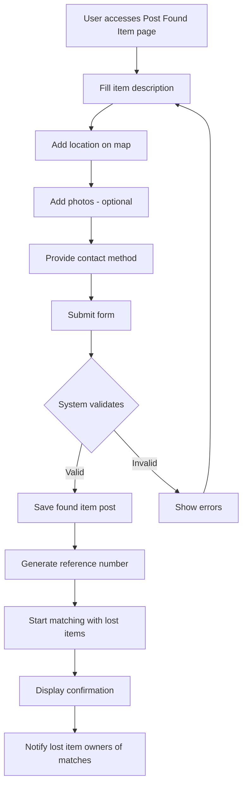
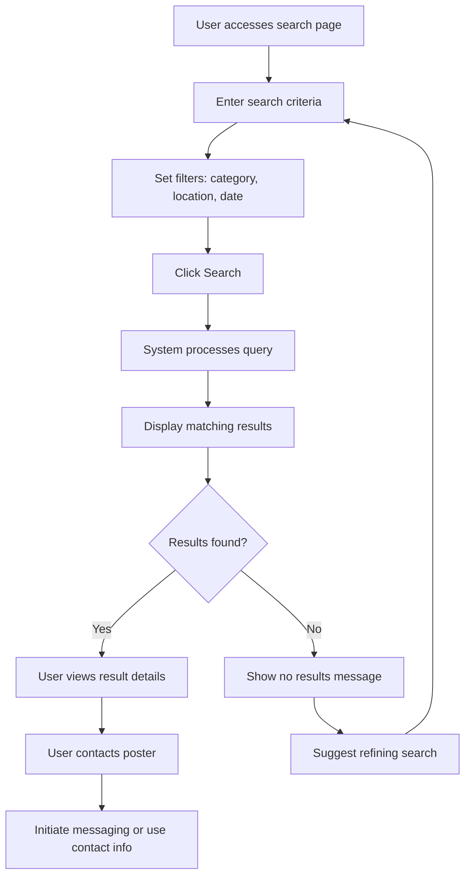
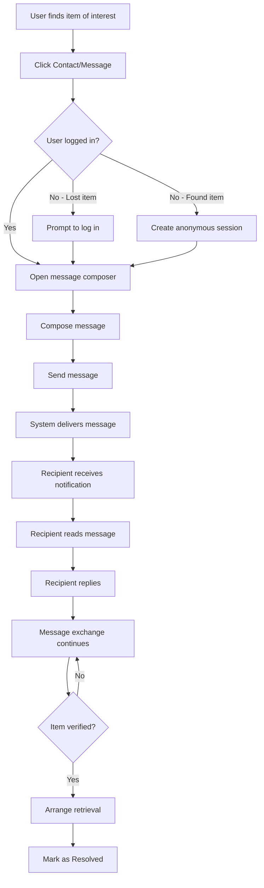
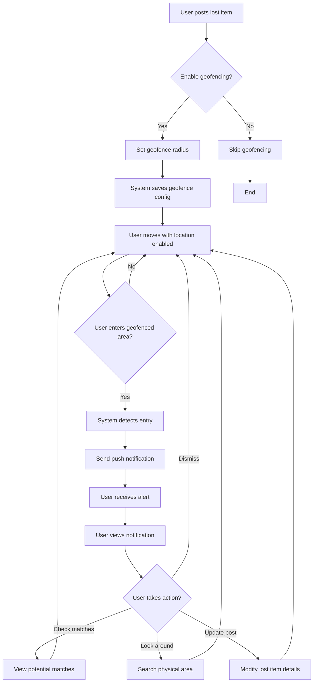

# User Journeys

This document outlines the detailed user journeys for the Lost and Found platform, including workflow diagrams and future journey ideas.

---

## Table of Contents
1. [User Journey for Registration](#user-journey-for-registration)
2. [User Journey for Posting Lost Items](#user-journey-for-posting-lost-items)
3. [User Journey for Posting Found Items (No Registration Required)](#user-journey-for-posting-found-items-no-registration-required)
4. [User Journey for Searching Items](#user-journey-for-searching-items)
5. [User Journey for Messaging](#user-journey-for-messaging)
6. [User Journey for Geofencing Alerts](#user-journey-for-geofencing-alerts)
7. [Additional User Journey Ideas](#additional-user-journey-ideas)

---

## User Journey for Registration

### Description
Users who wish to post lost items or track their submissions must register for an account. Registration collects minimal information to respect user privacy.

### Steps
1. **User visits the registration page.**
2. **User fills out the registration form with minimal required information**:
   - Email address (primary identifier)
   - Password
   - Display name (optional, for privacy)
   - Phone number (optional)
3. **User submits the form.**
4. **System validates input** and either:
   - Success: Sends a confirmation email to the user.
   - Error: Displays specific error messages (e.g., email already exists, weak password).
5. **User clicks the confirmation link** in the email to verify their account.
6. **System confirms email verification** and directs the user to the login page.
7. **User can now log in** and access registered user features.

### Mermaid Diagram

---

## User Journey for Posting Lost Items

### Description
Registered users can post details about items they have lost. The system collects minimal information and offers geofencing alerts for when users enter the area where the item was lost.

### Steps
1. **User logs into their account.**
2. **User navigates to the 'Post Lost Item' section.**
3. **User fills out the form with minimal required details**:
   - Item description (type, color, distinguishing features)
   - Category (optional: electronics, jewelry, documents, etc.)
   - Date lost
   - Location lost (with map picker)
   - Optional: Upload photo(s)
4. **User optionally enables geofencing alerts** for the lost location.
5. **User submits the form.**
6. **System validates and saves the submission.**
7. **System confirms submission** and provides a unique reference number.
8. **System begins matching** the lost item with existing found item posts.
9. **User receives notifications** if potential matches are found.

### Mermaid Diagram

---

## User Journey for Posting Found Items (No Registration Required)

### Description
To encourage reporting of found items, users can post found items **without registration**. This reduces friction and maximizes the likelihood that found items are reported. Only minimal contact information is collected.

### Steps
1. **User accesses the homepage or 'Post Found Item' page** (no login required).
2. **User fills out the found item form with minimal information**:
   - Item description (type, color, distinguishing features)
   - Category (optional)
   - Date found
   - Location found (with map picker)
   - Contact method (email OR phone - only one required)
   - Optional: Upload photo(s)
3. **User submits the form.**
4. **System validates the submission** (basic validation only).
5. **System saves the found item post** and provides a reference number.
6. **System begins matching** with existing lost item posts.
7. **System sends potential match notifications** to users who posted lost items.
8. **Optional: User can provide an anonymous post ID** to check status later without registration.

### Mermaid Diagram

---

## User Journey for Searching Items

### Description
All users (registered and unregistered) can search for lost or found items using various filters and criteria.

### Steps
1. **User accesses the homepage or search page.**
2. **User enters search criteria**:
   - Item description/keywords
   - Category filter
   - Location (area, city, or map radius)
   - Date range
   - Item status (lost or found)
3. **User clicks 'Search'.**
4. **System processes search query** using keywords and geospatial data.
5. **System displays matching results** with:
   - Item thumbnails (if photos available)
   - Brief description
   - Location
   - Date posted
   - Match confidence score (if applicable)
6. **User views detailed information** by clicking on a result.
7. **User can contact the poster** through the platform messaging system or provided contact info.
8. **User can refine search** and repeat as needed.

### Mermaid Diagram

---

## User Journey for Messaging

### Description
Users can communicate securely through the platform's messaging system to discuss item details, verify ownership, and arrange retrieval.

### Steps
1. **User finds an item of interest** from search results or notifications.
2. **User clicks 'Contact' or 'Message'** on the item listing.
3. **System checks user status**:
   - If not logged in and contacting about a lost item: Prompts to log in or register.
   - If posting found item without registration: Creates temporary anonymous messaging session.
4. **User composes a message** with item-specific context (reference number auto-included).
5. **User sends the message.**
6. **System delivers the message** to the recipient via:
   - In-platform notification
   - Email notification (with privacy protection)
7. **Recipient receives and reads the message.**
8. **Recipient can reply** through the platform.
9. **Users exchange messages** until they:
   - Verify ownership
   - Arrange meeting location
   - Confirm item retrieval
10. **Either user can mark the item as 'Resolved/Returned'.**

### Mermaid Diagram

---

## User Journey for Geofencing Alerts

### Description
Users who posted lost items can enable geofencing alerts. When they enter the area where they lost their item, they receive a reminder notification to look around and check for updates.

### Steps
1. **User posts a lost item** and opts into geofencing alerts.
2. **User sets the geofence radius** (e.g., 100m, 500m, 1km) around the lost location.
3. **System saves geofence configuration** with the lost item post.
4. **User goes about their daily activities** with location services enabled on their device.
5. **User enters the geofenced area.**
6. **System detects the user's location** entering the geofence.
7. **System sends a push notification** to the user:
   - "You're near where you lost your [item]. Keep an eye out!"
   - Includes a link to check for new matches or updates.
8. **User can view the notification** and take action:
   - Check for new found item matches
   - Look around the area
   - Update the lost item post if needed
9. **User can disable or modify geofencing** at any time through their post settings.

### Mermaid Diagram

---

## Additional User Journey Ideas

The following are potential user journeys for future implementation. These ideas are listed without detailed implementation plans.

1. **Social Sharing Journey**: Users share lost/found item posts to social media platforms (Facebook, Twitter, Instagram) to increase visibility and reach.

2. **Community Reputation System**: Users earn reputation points for successfully helping return items, with badges and leaderboards to gamify the experience.

3. **QR Code Generation for Items**: Users generate and print QR codes to attach to valuable items, linking directly to their contact info if the item is found.

4. **AI-Powered Image Matching**: System uses computer vision to automatically match photos of lost items with found items, suggesting high-confidence matches.

5. **Institution Integration Journey**: Schools, airports, or transit authorities integrate the platform as their official lost and found system with custom branding.

6. **Reward Posting Journey**: Users offer rewards for finding lost items, with secure payment processing through the platform.

7. **Multi-Language Support Journey**: International users access the platform in their preferred language with automatic translation of item descriptions.

8. **Item Insurance Claim Integration**: Users link lost item posts to insurance claims, generating necessary documentation and proof of loss.

9. **Recurring Lost Item Alerts**: Users who frequently lose similar items (keys, wallet) can set up recurring alerts and quick-post templates.

10. **Good Samaritan Verification**: Users who find and return items can request verification certificates for volunteer hours or community service records.

---

## Privacy and Data Protection Notes

- **Minimal Data Collection**: Only essential information is collected from users to respect privacy.
- **No Registration for Found Items**: Reduces friction and encourages reporting without requiring personal account creation.
- **Anonymous Messaging**: Users can communicate without revealing personal contact details until they choose to.
- **Data Retention**: Item posts are automatically archived after resolution or a set period (e.g., 90 days).
- **Location Privacy**: Precise locations are fuzzy-matched to protect exact addresses; only general area is shown publicly.

---

## Conclusion

These user journeys emphasize ease of use, privacy protection, and effective communication between users. By removing registration requirements for found items and implementing features like geofencing alerts and in-platform messaging, the Lost and Found platform maximizes the chances of reuniting people with their lost belongings while maintaining a user-friendly experience.