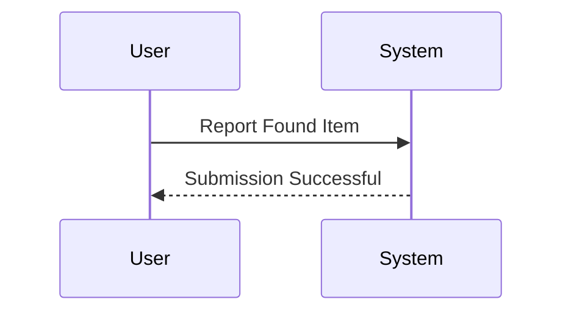
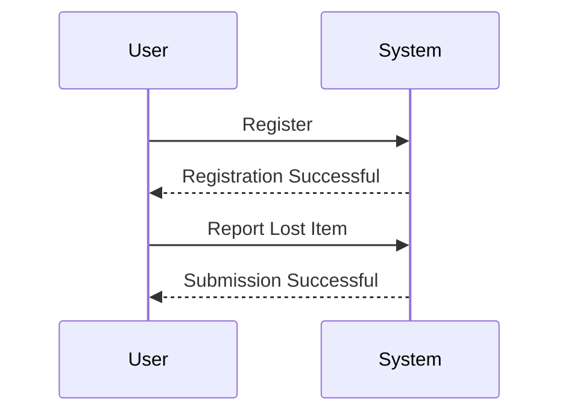

# User Journeys

## Reporting Found Items
- Users can report a found item without registration. 
- Example: "I found this hat in the park."

## Reporting Lost Items and Other Workflows
- Users must register before reporting a lost item or engaging in any other user workflow.

## Steps for Reporting Found Items:
1. User selects "Report Found Item" option.
2. User submits details of the found item (e.g., description, location).

### Mermaid Diagrams

## Steps for Reporting Lost Items:
1. User must first register.
2. User selects "Report Lost Item" after registration.
3. User submits details of the lost item.

### Mermaid Diagrams

## Summary
- If a user wants to report a found item, they can do so directly. 
- For all other workflows, registration is required before proceeding.